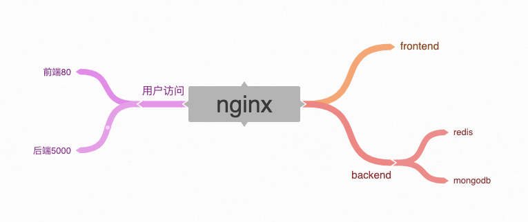

# start command

`docker-compose up`

# Abstract Architecture



# File Architecture


```bash
.
├── Architecture.png
├── README.md
├── backend
│   ├── __pycache__
│   │   └── app.cpython-37.pyc
│   ├── app.py
│   ├── dockerfile
│   └── requirements.txt
├── docker-compose.yml
├── frontend
│   ├── dist
│   │   ├── favicon.26242483.ico
│   │   ├── frontend.9ad09f98.css
│   │   ├── frontend.9ad09f98.css.map
│   │   ├── frontend.9ad09f98.js
│   │   ├── frontend.9ad09f98.js.map
│   │   ├── frontend.e31bb0bc.js
│   │   ├── frontend.e31bb0bc.js.map
│   │   └── index.html
│   ├── dockerfile
│   ├── favicon.ico
│   ├── index.css
│   ├── index.html
│   ├── index.js
│   ├── package-lock.json
│   ├── package.json
│   └── src
├── mongodb
├── nginx
│   ├── dockerfile
│   ├── nginx.conf
│   └── sites-enabled
│       └── default
├── redis
└── run.sh

9 directories, 26 files
```